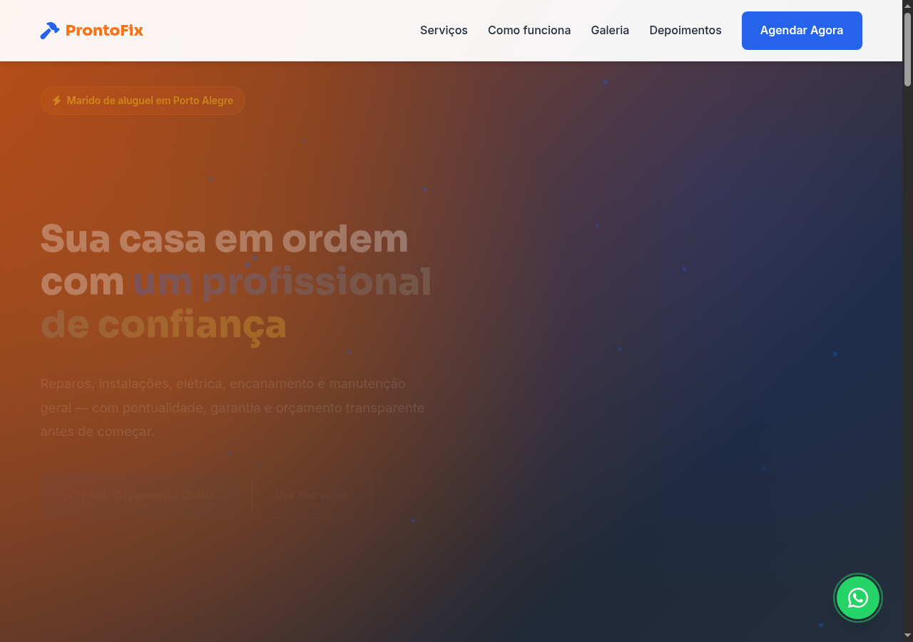

# ProntoFix — Marido de Aluguel

Landing page de alta conversão para serviço de marido de aluguel fictício, desenvolvida com foco em responsividade, acessibilidade e integração WhatsApp.

## Demo

👉 **[Ver site ao vivo](https://tofariasti.github.io/marido-aluguel/)**

## Screenshots

### Desktop


### Tablet


### Mobile


## Funcionalidades

- Design responsivo (mobile-first)
- Integração WhatsApp com formulário pré-preenchido para agendamento
- Animações suaves ao scroll (AOS library)
- Partículas animadas no hero
- Contador animado de estatísticas
- FAQ interativo com accordion
- Menu mobile hamburger
- Botão flutuante WhatsApp com pulse
- Smooth scroll e navegação ativa
- Acessibilidade WCAG AA (skip link, ARIA, contraste, foco visível)
- Respeita `prefers-reduced-motion`

## Seções

1. **Hero** — Headline impactante com CTA, estatísticas e imagem
2. **Serviços** — Grid com 9 serviços residenciais
3. **Como funciona** — 3 passos do pedido ao serviço
4. **Diferenciais** — 6 motivos para contratar
5. **Galeria** — Fotos de trabalhos realizados
6. **Depoimentos** — 3 avaliações de clientes
7. **CTA** — Seção de conversão intermediária
8. **FAQ** — Perguntas frequentes interativas
9. **Contato** — Formulário WhatsApp para agendamento
10. **Footer** — Rodapé com links e créditos

## Tecnologias

- HTML5 semântico
- CSS3 (Flexbox/Grid, custom properties)
- JavaScript vanilla (ES6+)
- AOS (Animate On Scroll) v2.3.4
- Font Awesome 6.4
- Google Fonts (Inter + Sora)

## Testes de Responsividade

| Dispositivo | Resolução | Status |
|-------------|-----------|--------|
| iPhone SE | 375×667 | ✅ |
| iPhone 12 Pro | 390×844 | ✅ |
| iPhone 14 Pro Max | 428×926 | ✅ |
| iPad | 768×1024 | ✅ |
| iPad Pro | 1024×1366 | ✅ |
| Desktop HD | 1280×720 | ✅ |
| Desktop FHD | 1920×1080 | ✅ |

## Acessibilidade

- Semântica HTML5 adequada
- Atributos ARIA quando necessário
- Contraste WCAG AA (4.5:1)
- Navegação por teclado (Escape fecha menu)
- Focus states visíveis
- Alt text em imagens
- Labels em formulários
- Font-size mínimo 16px mobile
- Skip link para conteúdo principal

## Como usar

```bash
git clone https://github.com/tofariasti/marido-aluguel.git
cd marido-aluguel
# Abrir index.html no navegador (preview com moldura iframe)
# Ou abrir site/index.html para tela cheia
python3 -m http.server 8080
```

## Personalização

1. **WhatsApp:** altere `WHATSAPP_NUMBER` em `site/assets/js/main.js`
2. **Cores:** edite as variáveis CSS em `:root` no `site/assets/css/style.css`
3. **Textos e serviços:** edite `site/index.html`

## Estrutura

```
maridoaluguel/
├── index.html              # Preview shell (moldura iframe)
├── assets/css/preview.css
├── assets/js/preview.js
├── site/
│   ├── index.html          # Landing page
│   └── assets/
│       ├── css/style.css
│       └── js/main.js
├── screenshots/
├── .github/workflows/deploy.yml
└── README.md
```

## Autor

**Tiago O. de Farias** — [Farias Digital](https://fariasdigital.com.br/)

- GitHub: [@tofariasti](https://github.com/tofariasti)
- WhatsApp: [(51) 99121-3724](https://wa.me/5551991213724)

---

<p align="center">
  <a href="https://tofariasti.github.io/marido-aluguel/">🌐 Demo Online</a> ·
  <a href="https://fariasdigital.com.br/">🏢 Site Comercial</a>
</p>
